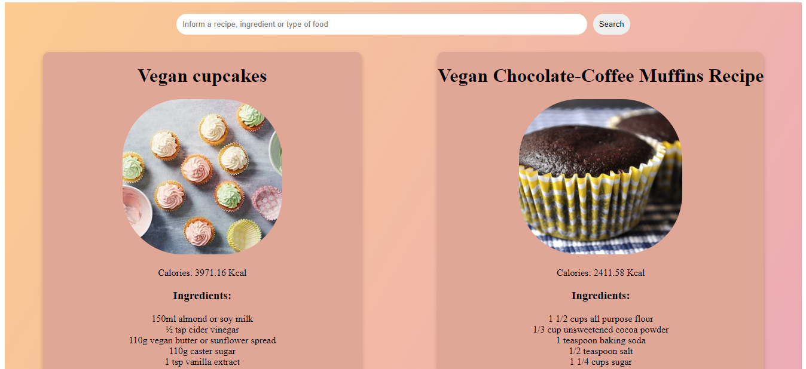

<h1 align="center">
  
</h1>

Este projeto foi inicializado com o [Create React App](https://github.com/facebook/create-react-app).

Com o react-recipe, você pode ver diversas receitas com seus ingredientes,
quantidade de carboidratos, proteínas, sódio, gorduras (totais, saturada e trans), além de abrir uma nova página com a receita completa com outros detalhes.

Para utilizar este projeto você precisa ter o id e a chave da [EDAMAM API](https://www.edamam.com/).

Com a chave e o id, crie um documento .env para gerar as seguintes variáveis de ambiente:

- REACT_APP_API_ID
- REACT_APP_API_KEY
